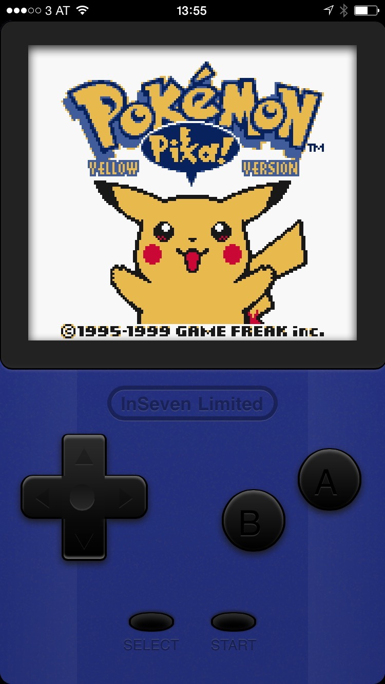

# Game Play Color

A JavaScript Game Boy Color emulator for iOS, based on the [GameBoy-Online](https://github.com/grantgalitz/GameBoy-Online) emulator core.

If you just want to play Game Play Color, you can find it online at [http://inseven.co.uk/apps/gameplaycolor](http://inseven.co.uk/apps/gameplaycolor).

## Screenshots

## Thanks

- [Grant Galitz](https://github.com/grantgalitz) for the GameBoy-Online emulator and core.
- [Pedro Ladaria](http://www.codebase.es/) for writing the JSGB core.
- [David McLeod](http://twitter.com/Mucx) for graphical inspiration on [Dribbble](http://dribbble.com/mucx) and for letting me know about MicrogrammaD-MediExte.
- [Paul Ledger](http://www.flexicoder.com) for suggesting the name 'Game Play'.
